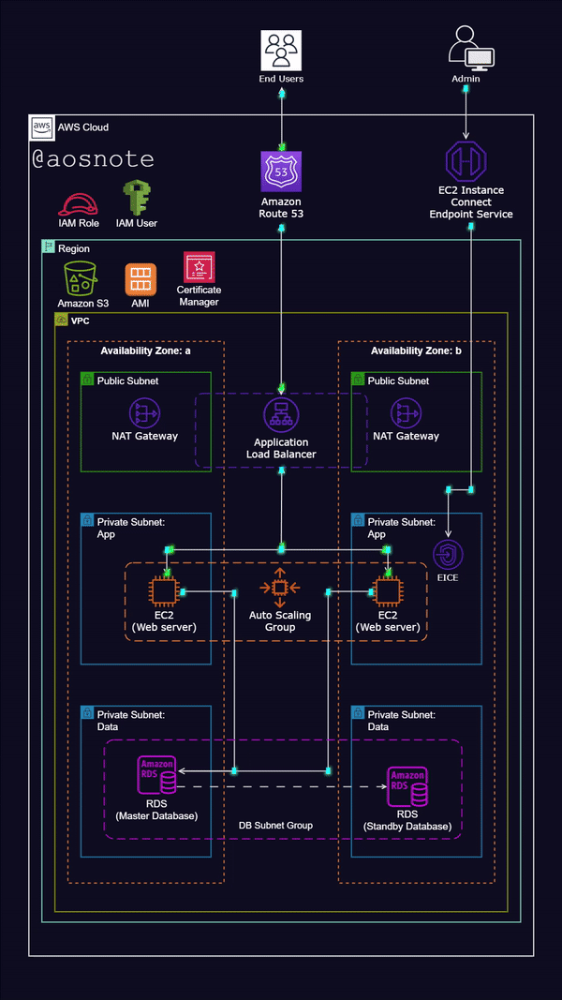
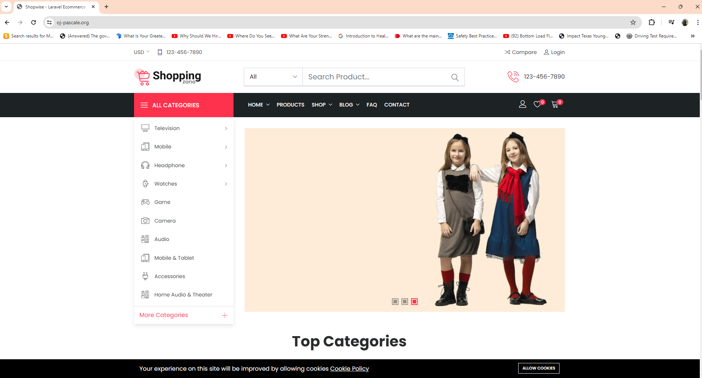

---

# Dynamic E-commerce Web App Deployment on AWS

This repository contains scripts and configuration files used to deploy a dynamic E-commerce web application on Amazon Web Services (AWS) using various services and resources.

## Project Overview

The project involves deploying a scalable, fault-tolerant, and highly available E-commerce web application on AWS infrastructure. The architecture leverages several AWS services to ensure reliability, security, and performance.

### Architecture Highlights

- **Virtual Private Cloud (VPC):** Utilizes a VPC with public and private subnets spread across two availability zones for high availability and fault tolerance.
- **Internet Gateway:** Allows communication between instances in the VPC and the internet.
- **Security Groups:** Implements firewall at the instance level for enhanced security.
- **NAT Gateway:** Facilitates internet access for instances in private subnets.
- **Bastion Host:** Enables secure access to instances in private subnets.
- **Application Load Balancer (ALB):** Distributes web traffic across an Auto Scaling Group of EC2 instances in multiple Availability Zones.
- **Auto Scaling Group:** Dynamically creates EC2 instances to ensure high availability, scalability, elasticity, and fault tolerance.
- **Amazon RDS (Relational Database Service):** Utilizes MySQL RDS database for data storage.
- **Amazon S3:** Stores web files for the E-commerce application.
- **Route 53:** Manages domain registration and DNS routing.
- **IAM Role:** Provides permissions to EC2 instances to access resources like S3 buckets.

## Deployment Scripts

### EC2 Instance Setup Script (`install-configure-app.sh`)

- Updates all packages on the server to their latest versions.
- Installs Apache web server and PHP along with necessary extensions.
- Installs MySQL version 8.
- Enables `mod_rewrite` module in Apache.
- Downloads web files from Amazon S3 to `/var/www/html`.
- Extracts application code and sets appropriate permissions.
- Configures environment variables.
- Restarts Apache server for changes to take effect.

### Flyway Database Migration Script (`migrate-sql-data.sh`)

- Updates all packages on the server.
- Downloads and extracts Flyway for database migration.
- Creates SQL directory for migrations.
- Downloads migration SQL script from AWS S3.
- Executes Flyway migration to update the MySQL database.

## Usage

1. Ensure you have necessary AWS credentials and permissions.
2. Modify the scripts with your specific configurations (e.g., S3 bucket name, RDS endpoint, database credentials).
3. Run the scripts on your EC2 instances in the desired order (`install-configure-app.sh` followed by `migrate-sql-data.sh`).

## Note

- Ensure proper IAM permissions are set for accessing AWS resources.
- Review security configurations to meet your organization's requirements.
- Test the deployment thoroughly before deploying in production environments.

---

Above, I have successfully deployed a secure, highly available, and fault-tolerant dynamic website on a 3-Tier architecture. 
